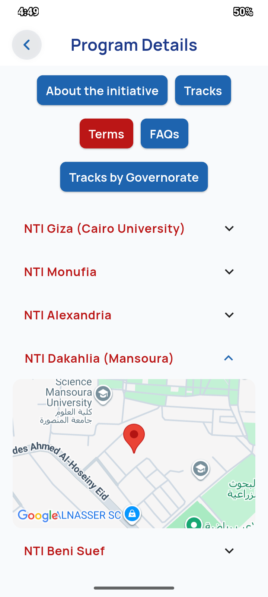
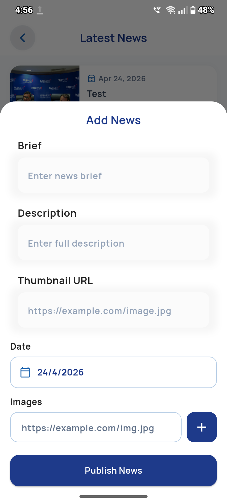
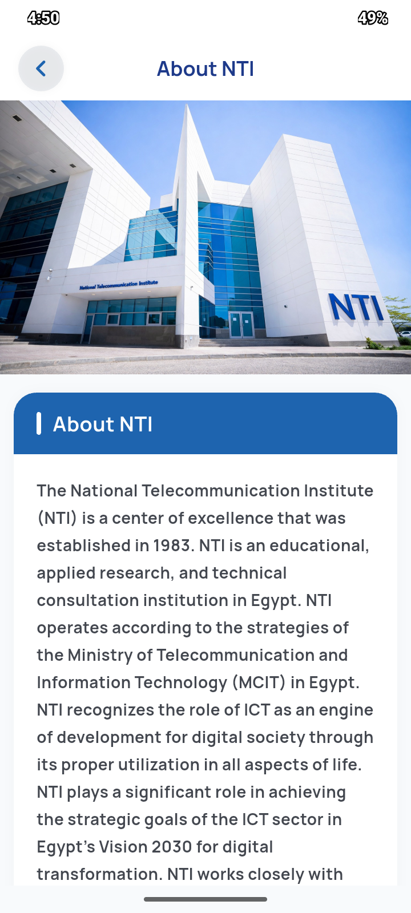
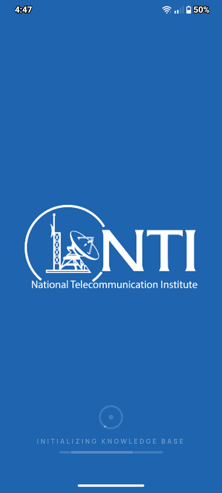

# 📱 NTI Guide App

NTI Guide App is a Flutter-based mobile application that helps users explore NTI programs and news in a simple and clean way.

---

## 🚀 Features
- Authentication (Login / Register)
- Splash & Onboarding
- Capacity Building Section
- News Section
- Admin Panel (Add News)
- About NTI
- Clean UI & Smooth Navigation

---

## 🧠 Architecture
- MVVM Architecture
- Clean Architecture
- Feature-based structure
- Separation between Logic & UI

---

## 🛠 Tech Stack
- Flutter
- Firebase (Auth + Firestore)
- Cloudinary
- GetIt (Dependency Injection)

---

## 📸 Screenshots

<p align="center">
  
  
  
</p>

<p align="center">
  
  
  
</p>

<p align="center">
  
  
</p>

---

## 🚀 How to Run
```bash
git clone https://github.com/tahtawy1/NTI-Guide.git
cd NTI-Guide
flutter pub get
flutter run
